# 01 — Setup Connection — Request Access and Connection
 
## Objective
 
Walk through the full lab entry path: request access to the lab environment, set up MFA for the lab tenant, sign in to Microsoft Foundry, create an agent, and attach the two existing MCP servers (`SentinelMCP`, `MdeMCP`) without exposing secrets. The main path ends once the test run completes successfully (picture 31). Viewing the run trace (pictures 32–33) is optional and only needed if you want to inspect how the agent called each tool.
 
 
## Part 1 — Request access to the lab environment
 
1. Scan the QR code shared by the facilitator to open the lab access request page, or open [This Page](https://myaccess.microsoft.com/@vertexia.onmicrosoft.com#/access-packages/082b0c14-b344-4a14-9abf-bd1e91ac5879).
 
   
 
2. The QR code opens a link to request access. Sign in with your Microsoft account (work or school account).
 
   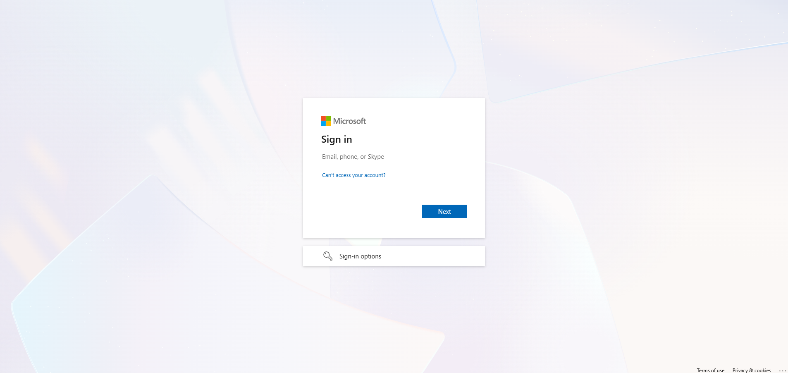
 
3. Complete authentication, including any MFA challenge your account already has configured.
 
   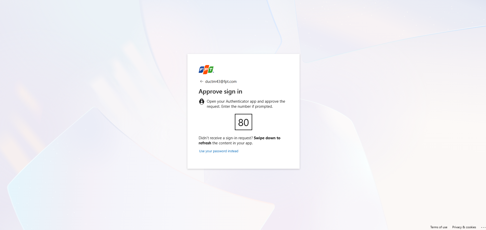
 
4. You land on the access request page for the lab package. Select **Next** to continue.
 
   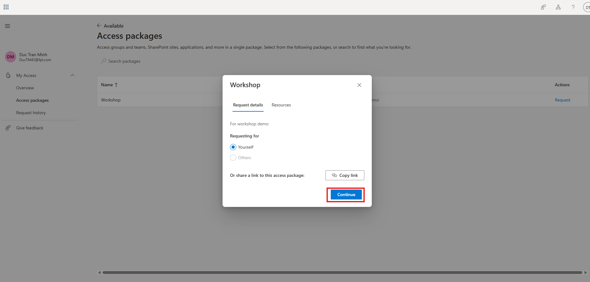
 
5. The request wizard may ask for optional business-justification questions. You do not need to fill anything in for this lab — select **Next** to skip.
 
   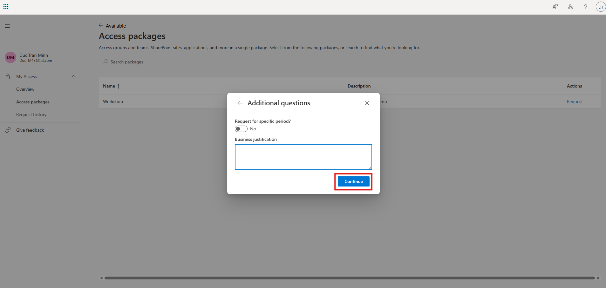
 
6. Read the access policy and consent statement, then agree to it.
 
   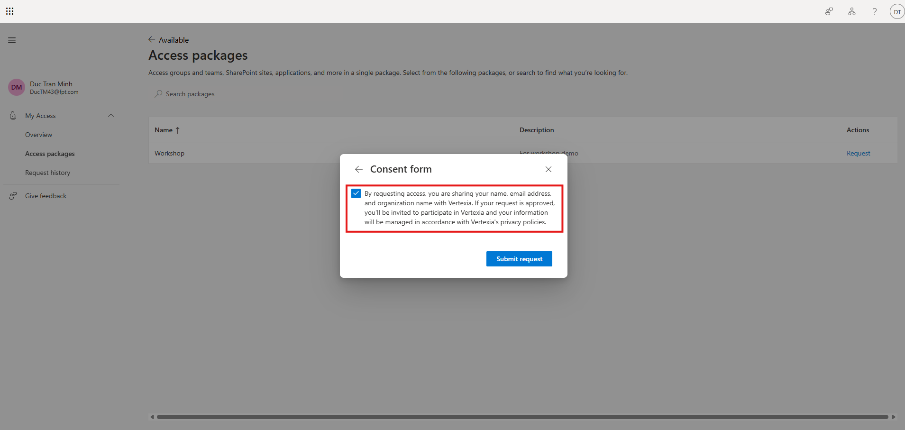
 
7. Select **Submit** to send the access request.
 
   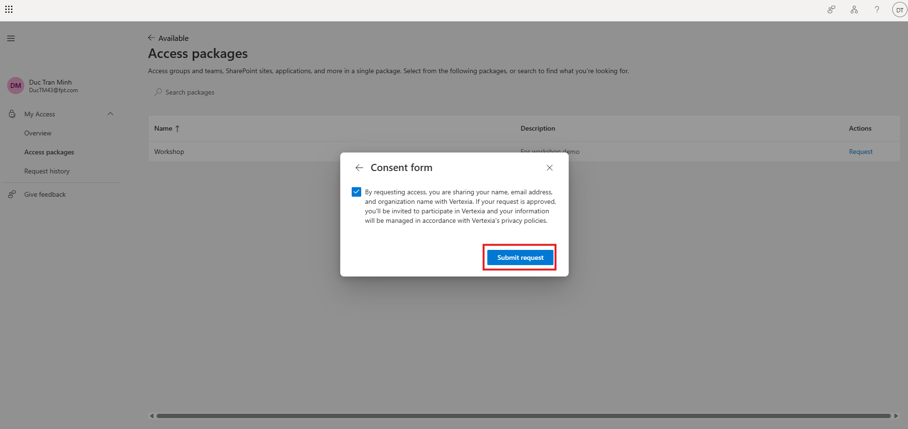
 
8. You receive a confirmation that the request was sent for approval.
 
   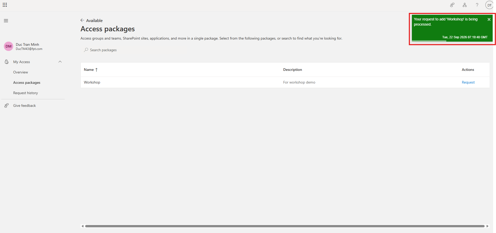
 
## Part 2 — Set up MFA for the lab tenant
 
9. Once the facilitator approves the request, you receive an access-granted notification. Sign in again to continue.
 
   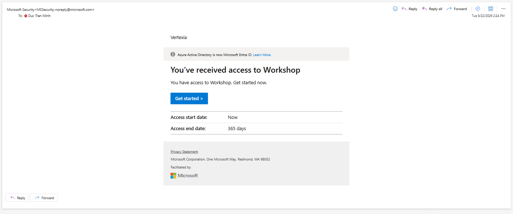

10. Access the [Lab Tennant](https://ai.azure.com/nextgen/r/vs3vNBEWQUKMEXsTfUzxGA,lab-001,,lab-project-001,lab-project-001/home?tid=cafab625-5df6-4945-a529-bc8a681714ef) 
 
11. The lab tenant requires more information to secure your account — start the **Set up MFA** flow.
 
    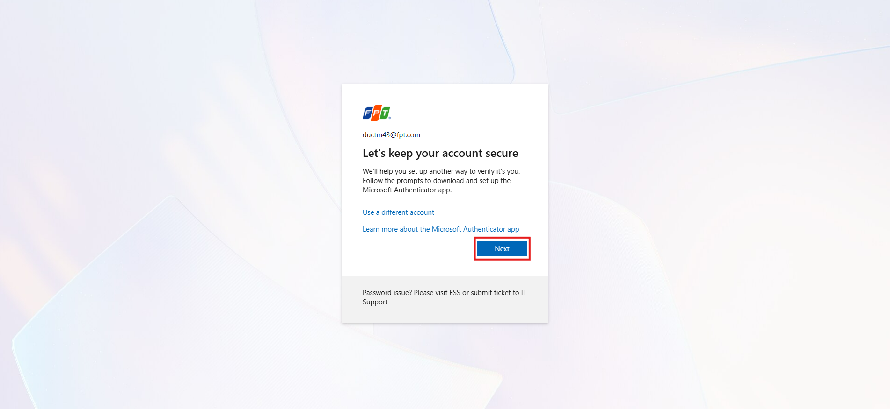
 
12. If you don't already have it, install the Microsoft Authenticator app on your phone before continuing.
 
    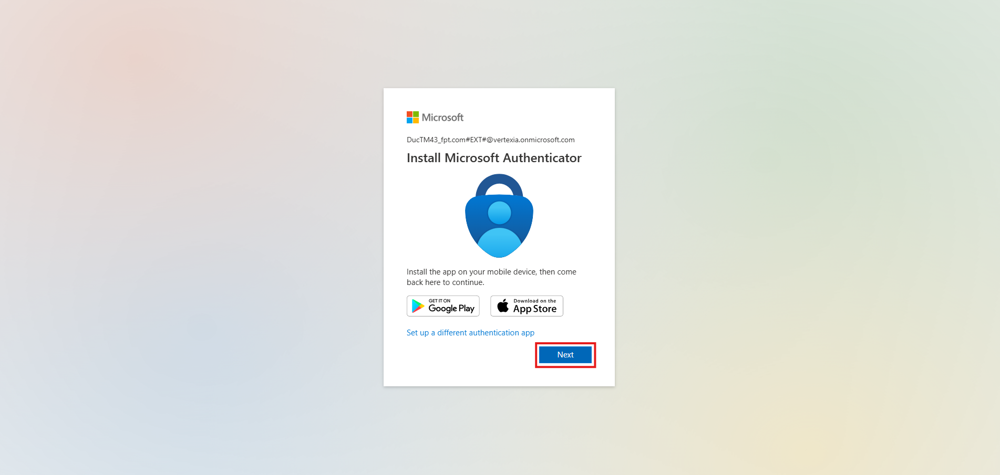
 
13. In the authenticator app, choose to add a work or school account so it's ready to scan the QR code.
 
    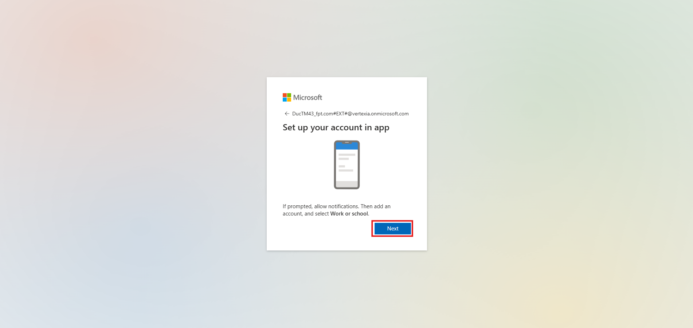
 
14. Scan the QR code shown on screen using your phone's authenticator app.
 
    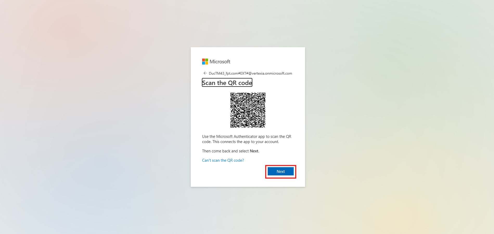
 
15. Type the number displayed on screen into the authenticator app on your phone to confirm the pairing.
 
    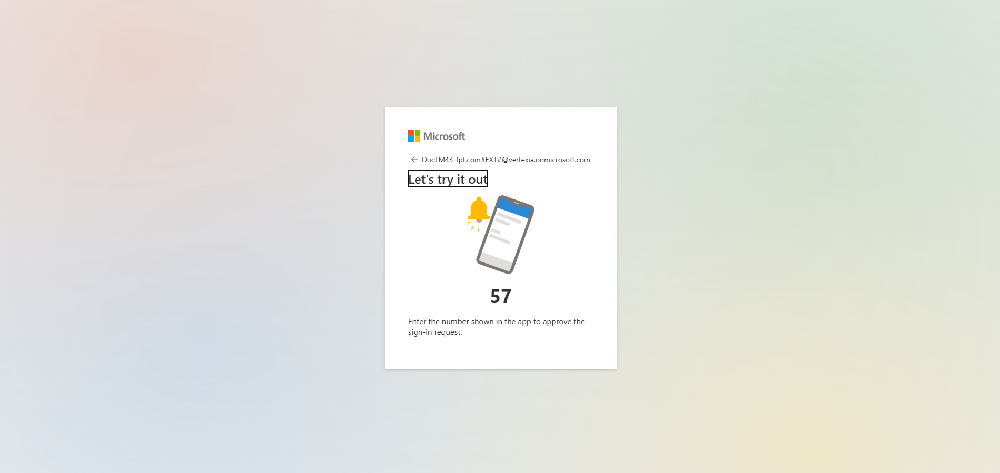
 
16. MFA setup is complete. You can continue into the lab tenant.
 
    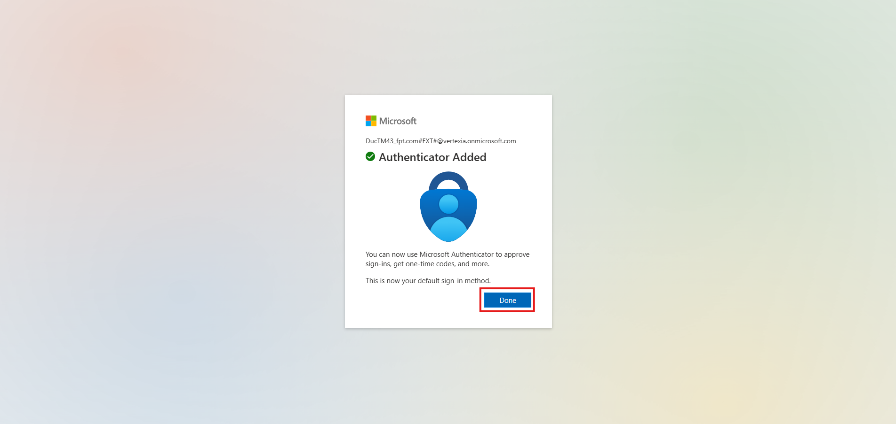
 
## Part 3 — Access Microsoft Foundry
 
16. Go to [https://ai.azure.com/](https://ai.azure.com/) and sign in with your lab account. You should see access to the shared `lab-project-001` project.
 
    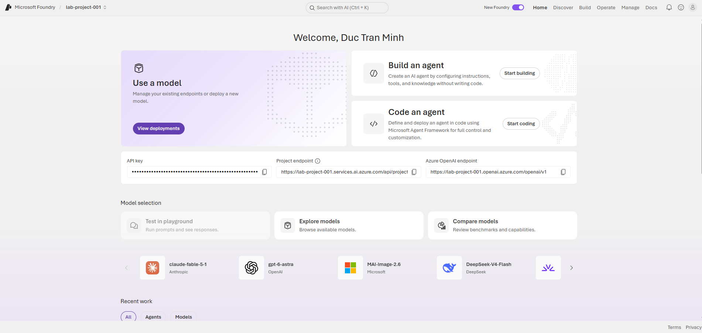
 
## Part 4 — Create the investigation agent
 
17. Select **Build** in the top navigation.
 
    
 
18. Under **Agents**, select **New agent**.
 
    
 
19. From the **New agent** menu, choose **Build an agent** (not **Code an agent** or **Link external agent**).
 
    
 
20. Enter a unique agent name, for example `LAB-INVESTIGATE-AGENT`, then select **Create**.
 
    
 
21. The agent editor opens with an empty **Instructions** field and a **Tools** section — the agent is ready to configure.
 
    
 
## Part 5 — Connect SentinelMCP and MdeMCP
 
22. Under **Tools**, select **Add**, then **Add tools** to open the tool picker.
 
    
 
23. On the **Configured** tab, find and select `SentinelMCP` from the list of already-configured tools.
 
    
 
24. With `SentinelMCP` checked, select **Add tool** to confirm.
 
    
 
25. Select **Add → Add tools** again, then choose `MdeMCP` from the **Configured** tab.
 
    
 
26. Select **Add tool** to confirm adding `MdeMCP`.
 
    
 
27. Both `SentinelMCP` and `MdeMCP` now appear under **Tools** with their endpoint URLs. Select **Save**.
 
    
 
## Part 6 — Verify the connection
 
28. In the **Chat** pane, send a simple test prompt, for example:
 
    ```text
    List the 5 most recent Sentinel alerts, sorted by severity. Do not remediate.
    ```
 
    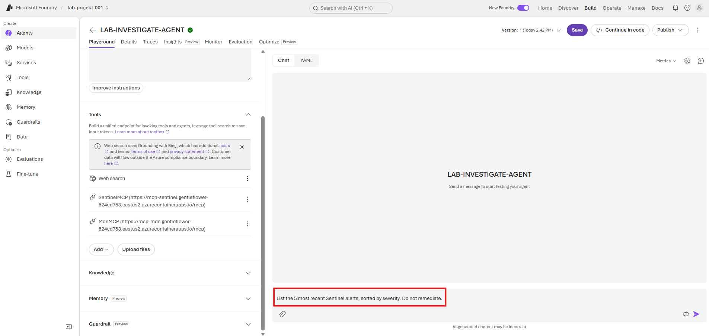
 
29. The agent starts running the request. Wait while it discovers and calls the MCP tools.
 
    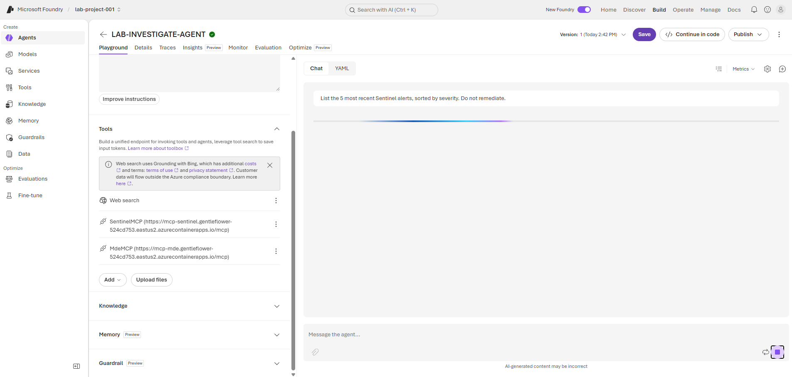
 
30. The agent requests approval before calling an MCP tool for the first time. Select **Approve**, or use the dropdown to choose **Always approve this tool** / **Always approve all tools** so you aren't prompted again during the lab.
 
    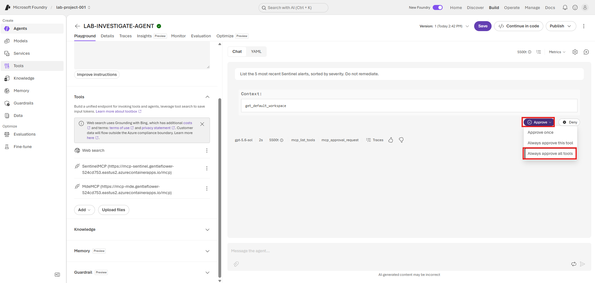
 
31. A second tool call (for example `SentinelMCP: get_table_schema`) may also request approval. Approve it the same way.
 
    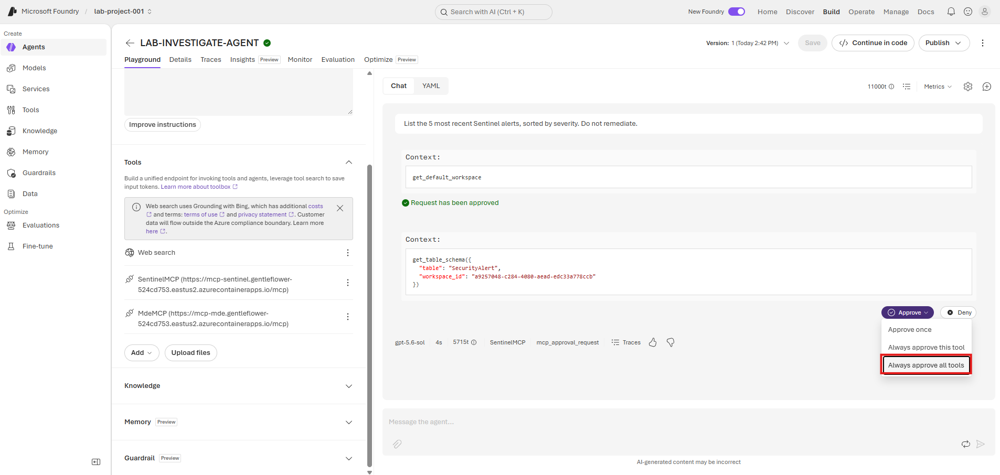
 
32. The run completes and returns the five most recent Sentinel alerts sorted by severity, confirming that both `SentinelMCP` and `MdeMCP` are connected and callable. **This completes the required setup.**
 
    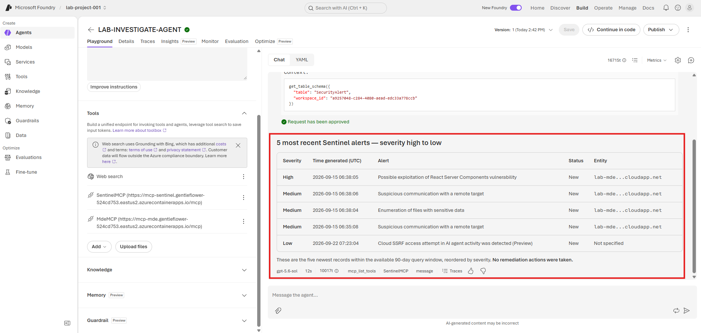
 
## Optional — View the run trace in detail
 
These two steps are optional. Use them only if you want to see exactly which tools the agent called and in what order.
 
33. On the completed response, select **Traces** to open the trajectory for that run.
 
    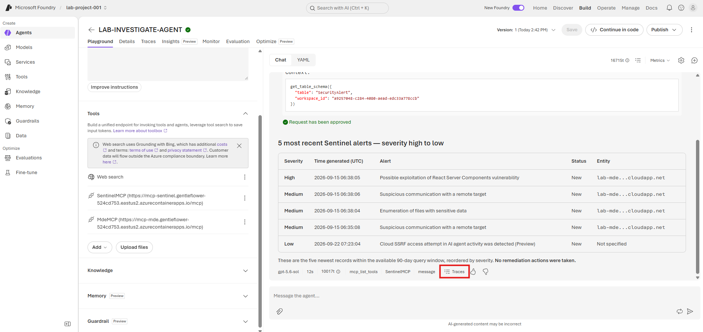
 
34. The trace view lists every step (`mcp_list_tools`, `SentinelMCP: get_table_schema`, `SentinelMCP: query_lake`, `message`) alongside the full **Input + Output** for the response. Select any step to inspect its arguments and result.
 
    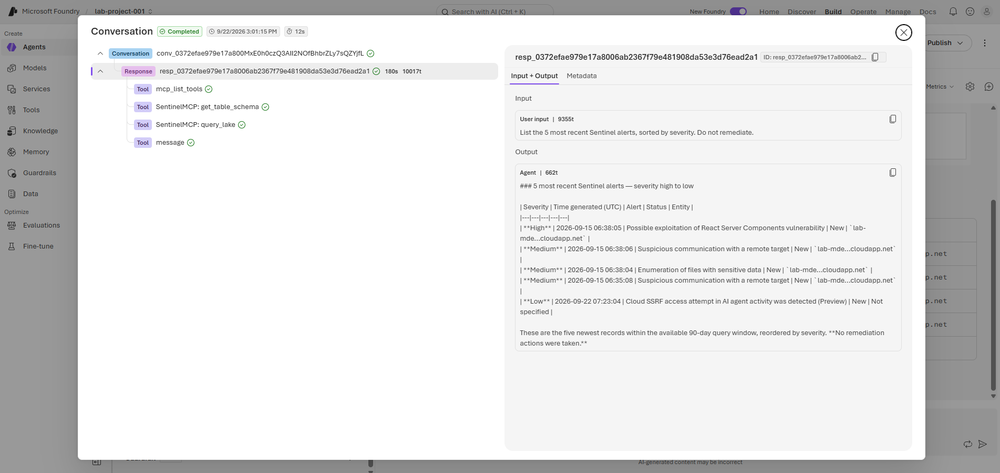
 
## Expected tool categories
 
| MCP | Expected investigation tools |
|---|---|
| SentinelMCP | Workspace discovery, table/schema discovery, KQL query, alert/incident lookup. |
| MdeMCP | Machine inventory, machine details, related alerts, endpoint telemetry lookup. |
 
## Validation
 
- Connection state must not show `401`, `403`, or `tools/list failed`.
- If a key changed, update both the Container App secret and the Foundry connection, then reconnect.
- Test the Investigation Agent directly before wiring it through any Orchestrator/A2A flow.
