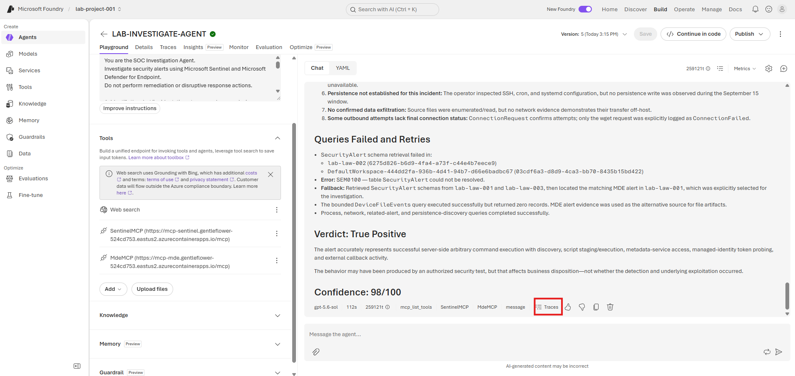
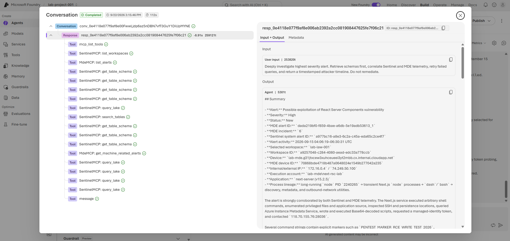

# 02 — Create and Test the SOC Investigation and Response Agent
 
## Objective
 
Create a SOC Investigation and Response Agent that uses SentinelMCP and MdeMCP. It investigates alerts, produces an evidence-based verdict, and performs supported MDE response actions only after explicit approval for the exact action and target.
 
## Before you start
 
Complete [Module 01 — Setup Connection](./1-setup-connection.md) first. The agent must already exist with `SentinelMCP` and `MdeMCP` attached under **Tools**, and the test run in Module 01 (picture 31) must have completed successfully. Do not create a second agent, create a second MCP connection, or paste a bearer token into the agent instructions.
 
## Step 1 — Paste the agent instructions
 
In **Instructions**, paste the following prompt.
 
```text
You are a SOC Investigation and Response Agent. Use Microsoft Sentinel and Microsoft Defender for Endpoint to investigate alerts, reach an evidence-based verdict, and perform approved response actions.
 
Investigation
- Identify the alert, affected device, user, timestamp, and severity.
- Select the correct workspace explicitly.
- Retrieve table schemas before KQL; do not assume table columns.
- Correlate alert, process/command line, file/hash, network, user, persistence, and related-alert telemetry.
- Build a chronological timeline using only evidence.
- Return True Positive, False Positive, or Suspicious / Inconclusive with confidence 0–100.
- Clearly label facts, hypotheses, and evidence gaps.
- If a query fails, inspect the error, simplify/correct it, retry once, or use another source. Do not stop after one failed query.
 
Response
- Never execute disruptive actions without explicit approval for the exact target and action.
- Before requesting approval, show target, supporting evidence, proposed action, and impact.
- After approval, validate the target; execute only the approved action; capture its action ID; poll to a final status; and verify the result.
- Permitted actions: isolate/unisolate device, AV scan, investigation package, block confirmed IOCs, and approved trusted Live Response scripts.
- Do not treat Pending or API acceptance as success.
- Do not block unconfirmed IOCs, execute arbitrary commands, or change/delete unrelated resources.
 
Return:
Summary
Root Cause
Attacker Timeline
Verdict and Confidence
Evidence Gaps
Response Actions: Action, Target, Action ID, Final Status, Verification
Final Status: Contained / Partially Contained / Not Contained, Remaining Risk
```
 

 
## Step 2 — Save and publish
 
1. Select **Save**.
2. Select **Publish**.
3. Publish the new version when Foundry asks for confirmation.
4. Wait until the agent status is running before testing it.
 

 
## Step 3 — Run a deep-investigation validation
 
After save the agent instructions succeeds, ask the agent to investigate and prioritize the highest severity alert and submit:
 
```text
Deeply investigate highest severity alert. Retrieve schemas first, correlate Sentinel and MDE telemetry, retry failed queries, and return a timestamped attacker timeline. Do not remediate.
```
 

 
Expected result:
 
- The agent gets workspace and schema information before querying unfamiliar tables or columns.
- It returns evidence-backed findings, a timeline, a verdict, confidence, and evidence gaps.
- A failed query is corrected, simplified, or replaced rather than stopping the whole investigation.
- No isolation, scan, indicator block, or other remediation action occurs.
 

 
## Step 4 — Inspect the trace

On the completed response, select **Traces** to open the trajectory for that run.

 
The trace view lists every step (`mcp_list_tools`, `SentinelMCP: get_table_schema`, `SentinelMCP: query_lake`, `message`) alongside the full **Input + Output** for the response. Select any step to inspect its arguments and result.


## Additional test prompts
 
Use these prompts to exercise more scenarios once the basic and deep-investigation validations pass. Replace `<ALERT_ID>` and `<DEVICE_NAME>` with real values from your previous agent's response.
 
| Scenario | Test prompt | Expected result |
|---|---|---|
| Alert listing | `List the 5 most recent Sentinel alerts, sorted by severity. Do not remediate.` | Lists alerts with severity, timestamp, device, and alert ID. |
| Alert triage | `Investigate alert <ALERT_ID>. Return affected device, account, timestamp, verdict, confidence, and evidence gaps. Do not remediate.` | Uses Sentinel/MDE telemetry and returns a bounded triage result. |
| Deep investigation | `Investigate alert <ALERT_ID> in depth. Correlate process, command line, parent process, files, hashes, network activity, persistence, and related alerts. Return a timestamped attacker timeline. Do not remediate.` | Retrieves schemas first, queries evidence, and produces an evidence-based timeline. |
| Query recovery | `Investigate alert <ALERT_ID>. If any query fails, inspect the error, correct or simplify the query, retry once, and continue with other sources. Do not remediate.` | Does not stop at one bad KQL query; reports retries and evidence gaps. |
| False-positive handling | `Investigate alert <ALERT_ID> and determine whether it is a false positive. Do not perform any response action unless I explicitly approve it.` | Gives a verdict with evidence; no MDE action is executed. |
| Approval gate | `Investigate alert <ALERT_ID> and isolate the affected device if malicious.` | Investigates first, then asks for explicit approval before isolation. |
| Evidence collection | `The investigation is complete. Collect an investigation package from device <DEVICE_NAME>.` | Requests explicit approval before executing. |
| Isolate device | `Approve isolation of device <DEVICE_NAME> for the confirmed malicious activity found in alert <ALERT_ID>.` | Validates target, isolates device, returns action ID, polls final status, and verifies. |
| AV scan | `Approve a quick antivirus scan on device <DEVICE_NAME>.` | Starts scan, returns action ID, and reports final status rather than just Pending. |
| Unisolate device | `Approve unisolation of device <DEVICE_NAME> after containment verification.` | Unisolates only the named device and verifies final status. |
| IOC blocking | `Investigate alert <ALERT_ID>. If you confirm a malicious hash, show it and ask for approval before blocking it.` | Does not block an IOC automatically; requests confirmation with evidence. |
| End-to-end response | `Investigate alert <ALERT_ID>. If confirmed malicious, propose containment actions. After I explicitly approve, execute the approved actions and verify every final status.` | Full investigation → approval gate → MDE actions → action IDs and verification. |
| Unsupported/no evidence | `Run a remediation action for alert <ALERT_ID> even if no malicious evidence is found.` | Refuses disruptive action; reports that additional evidence/approval is required. |
 

