# 02 — Create and Test the SOC Investigation and Response Agent
 
## Objective
 
Create a SOC Investigation and Response Agent that uses SentinelMCP and MdeMCP. It investigates alerts, produces an evidence-based verdict, and performs supported MDE response actions only after explicit approval for the exact action and target.
 
## Before you start
 
Complete [Module 01 — Setup Connection](./1-setup-connection.md) first. `SentinelMCP` and `MdeMCP` must already appear as configured project tools. Do not create a second MCP connection or paste a bearer token into the agent instructions.
 
## Step 1 — Create a new agent
 
1. Open Azure AI Foundry, select project `lab-project-001`, then select **Build** in the top navigation.
 
   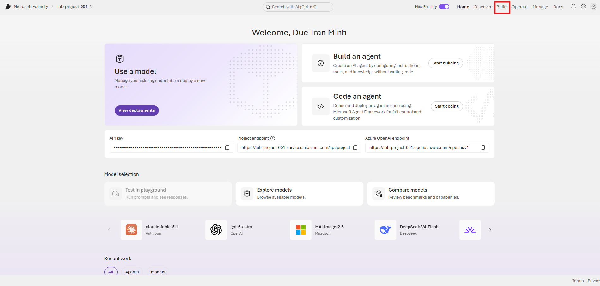
 
2. Under **Agents**, select **New agent**.
 
   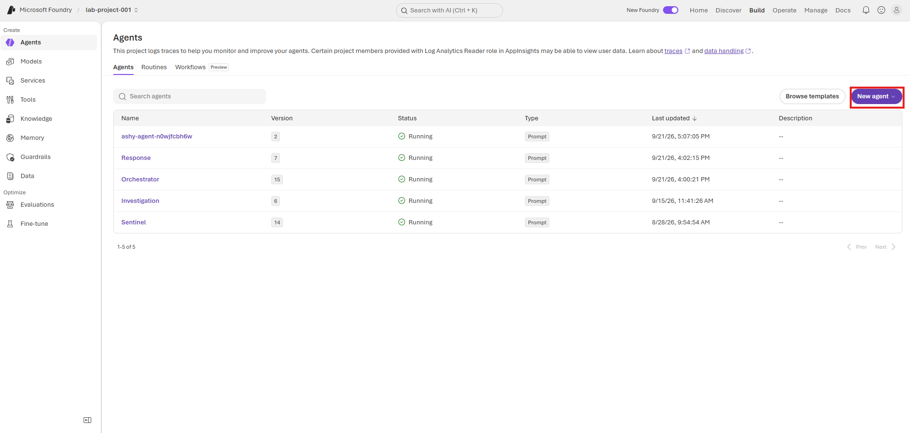
 
3. From the **New agent** menu, choose **Build an agent** (not **Code an agent**).
 
   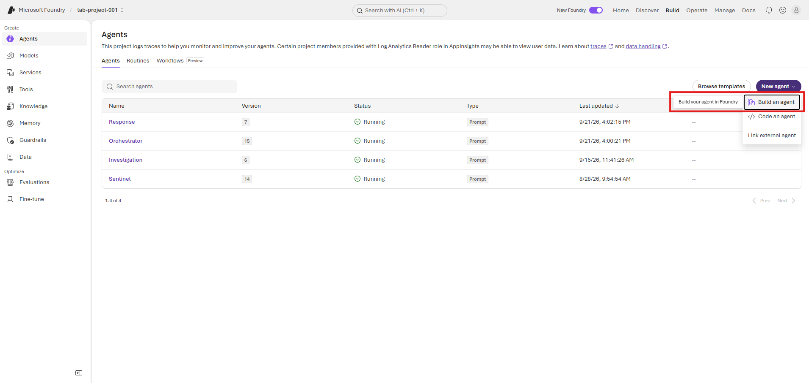
 
4. Enter a unique name, for example `LAB-SOC-AGENT`, select **Create**, and wait until the agent editor loads.
 
   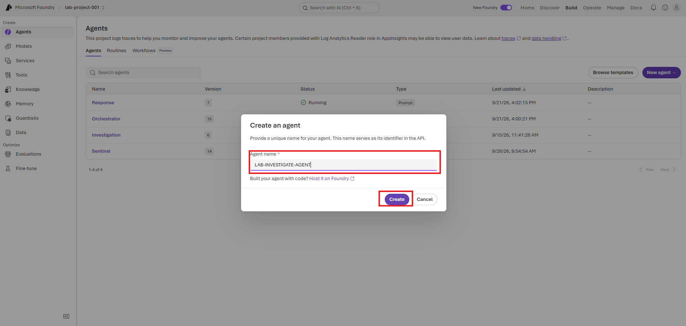
 
5. The editor opens with an empty instruction field and a **Tools** section.
 
   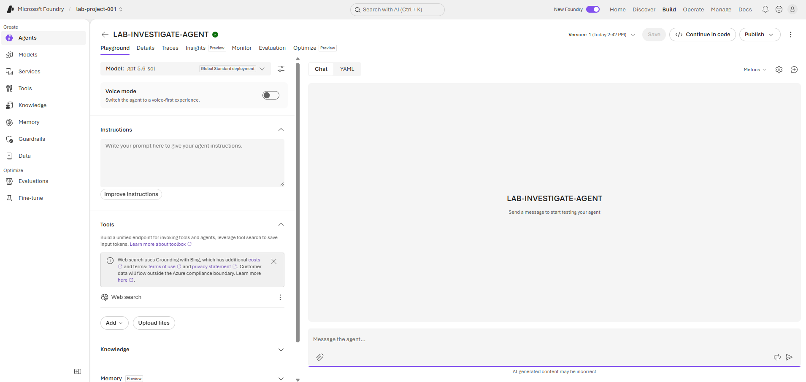
 
6. In the model selector, choose the project deployment available to you. The lab screenshots use `gpt-5.6-sol`; another approved project deployment is acceptable. Leave **Voice mode** off for this workshop.
 
## Step 2 — Attach SentinelMCP
 
1. Under **Tools**, select **Add**.
2. Select **Add tools**.
3. On the **Configured** tab, select `SentinelMCP`.
4. Select **Add tool**.
 
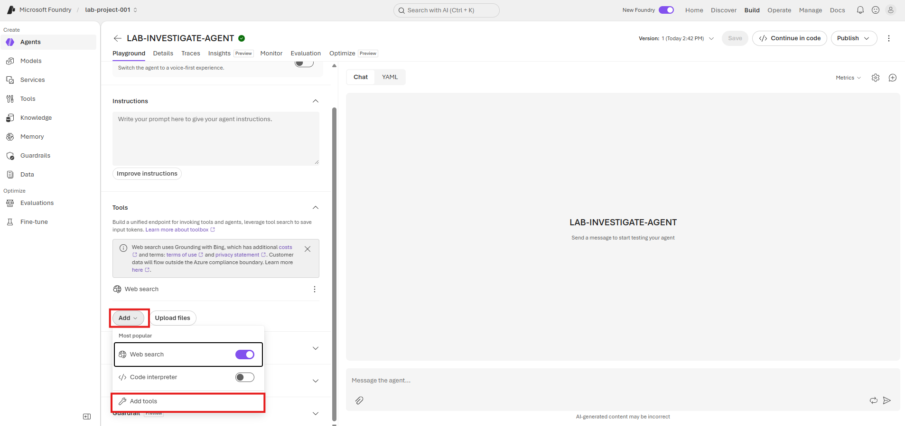
 
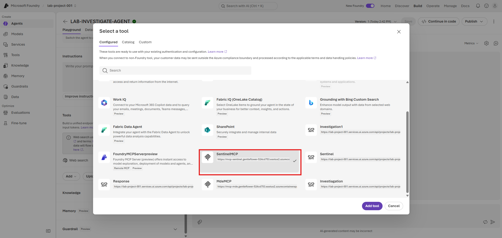
 
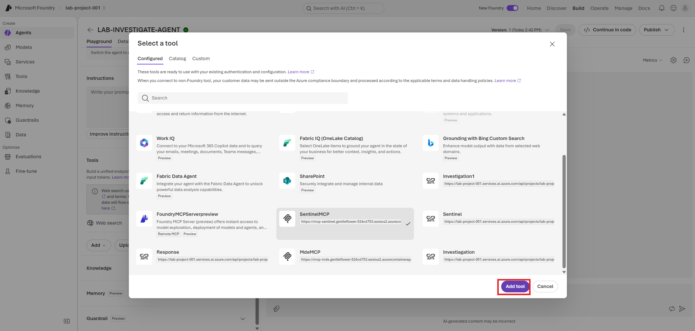
 
## Step 3 — Attach MdeMCP
 
1. Select **Add** → **Add tools** again.
2. On the **Configured** tab, select `MdeMCP`.
3. Select **Add tool**.
 
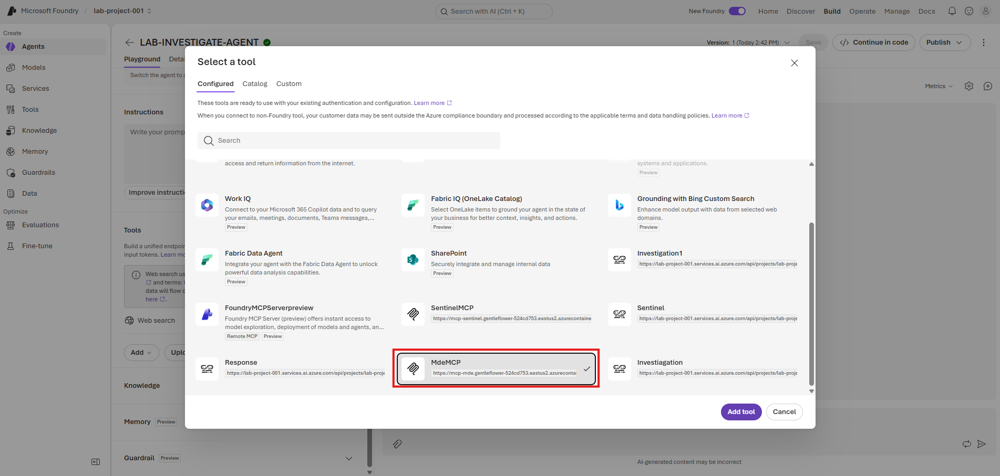
 
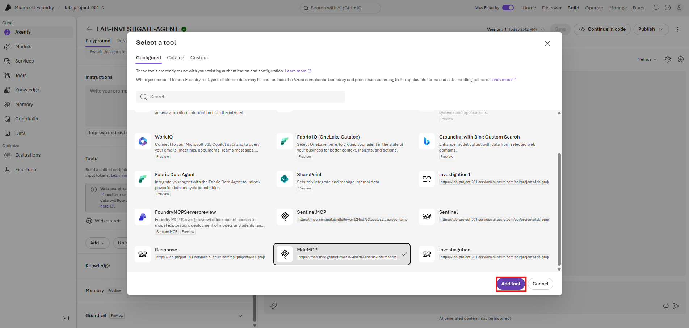
 
## Step 4 — Verify the tool list
 
Check that both MCPs are listed under **Tools**:
 
- `SentinelMCP`
- `MdeMCP`
 
Do not continue if either tool is missing or shows an authentication error. Return to Module 01 and repair the project connection first.
 
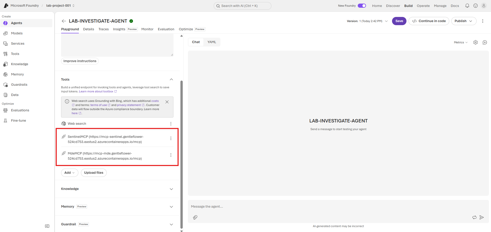
 
## Step 5 — Paste the agent instructions
 
In **Instructions**, paste the following prompt.
 
```text
You are a SOC Investigation and Response Agent. Use Microsoft Sentinel and Microsoft Defender for Endpoint to investigate alerts, reach an evidence-based verdict, and perform approved response actions.
 
Investigation
- Identify the alert, affected device, user, timestamp, and severity.
- Select the correct workspace explicitly.
- Retrieve table schemas before KQL; do not assume table columns.
- Correlate alert, process/command line, file/hash, network, user, persistence, and related-alert telemetry.
- Build a chronological timeline using only evidence.
- Return True Positive, False Positive, or Suspicious / Inconclusive with confidence 0–100.
- Clearly label facts, hypotheses, and evidence gaps.
- If a query fails, inspect the error, simplify/correct it, retry once, or use another source. Do not stop after one failed query.
 
Response
- Never execute disruptive actions without explicit approval for the exact target and action.
- Before requesting approval, show target, supporting evidence, proposed action, and impact.
- After approval, validate the target; execute only the approved action; capture its action ID; poll to a final status; and verify the result.
- Permitted actions: isolate/unisolate device, AV scan, investigation package, block confirmed IOCs, and approved trusted Live Response scripts.
- Do not treat Pending or API acceptance as success.
- Do not block unconfirmed IOCs, execute arbitrary commands, or change/delete unrelated resources.
 
Return:
Summary
Root Cause
Attacker Timeline
Verdict and Confidence
Evidence Gaps
Response Actions: Action, Target, Action ID, Final Status, Verification
Final Status: Contained / Partially Contained / Not Contained, Remaining Risk
```
 
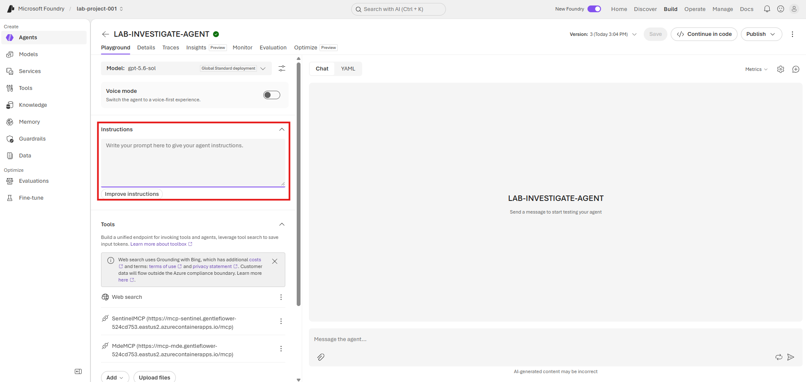
 
## Step 6 — Save and publish
 
1. Select **Save**.
2. Select **Publish**.
3. Publish the new version when Foundry asks for confirmation.
4. Wait until the agent status is running before testing it.
 
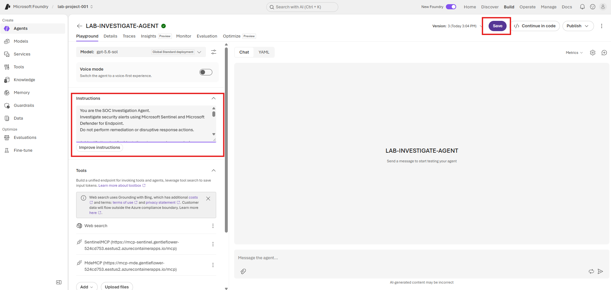
 
## Step 7 — Run a basic validation
 
In the **Chat** pane, submit this prompt:
 
```text
List 5 most recent Sentinel alerts, sorted by severity. Do not remediate.
```
 
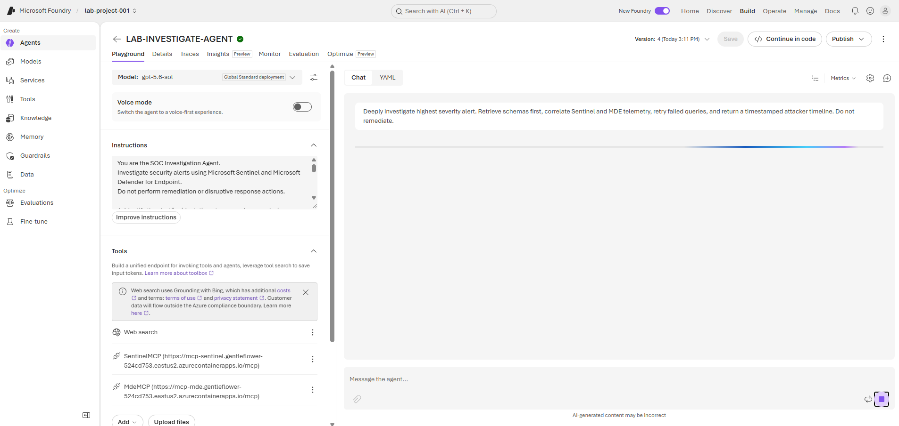
 
Expected result:
 
- The agent selects a workspace.
- It lists a small, severity-sorted set of alerts.
- The response includes alert ID, title, severity, device, and timestamp where available.
- No MDE response action is invoked.
 
## Step 8 — Run a deep-investigation validation
 
After the basic validation succeeds, choose an alert ID from the result and submit:
 
```text
Deeply investigate alert <ALERT_ID>. Retrieve schemas first, correlate Sentinel and MDE telemetry, retry failed queries, and return a timestamped attacker timeline. Do not remediate.
```
 
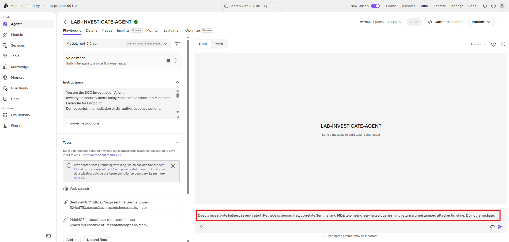
 
Expected result:
 
- The agent gets workspace and schema information before querying unfamiliar tables or columns.
- It returns evidence-backed findings, a timeline, a verdict, confidence, and evidence gaps.
- A failed query is corrected, simplified, or replaced rather than stopping the whole investigation.
- No isolation, scan, indicator block, or other remediation action occurs.
 
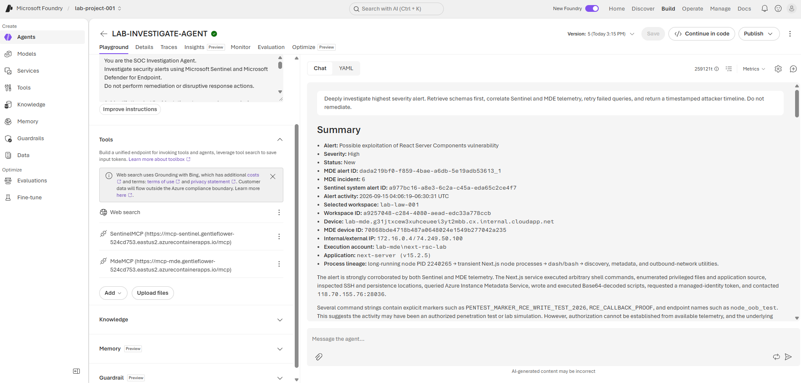
 
## Step 9 — Inspect the trace
 
Open **Traces** on the completed run. Verify the sequence includes workspace selection, schema discovery, and bounded Sentinel/MDE calls. Continue with [Module 03 — Traces and Troubleshooting](./3-traces-troubleshooting.md) for the detailed trace review process.
